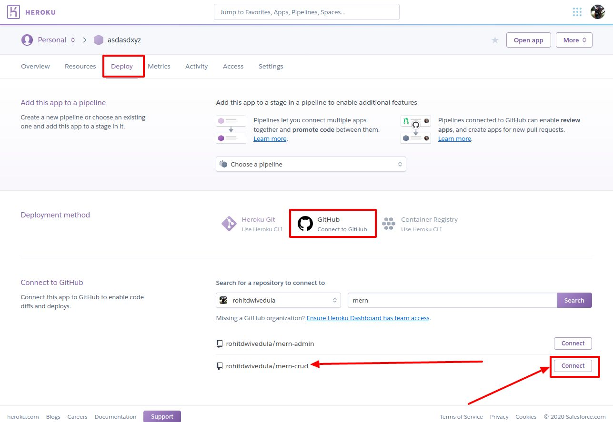
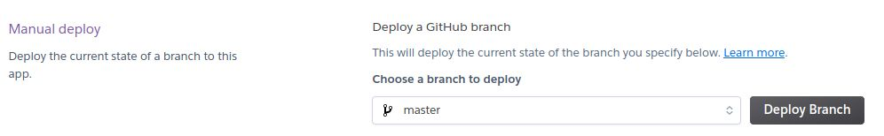
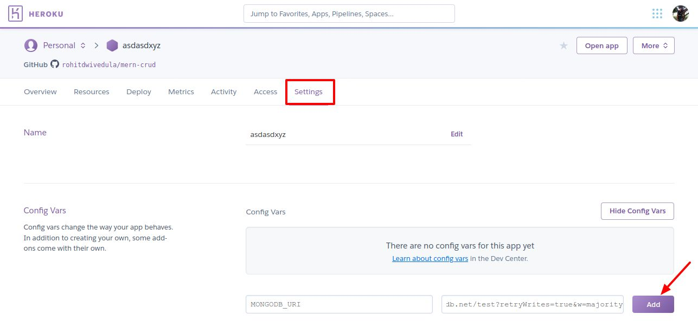
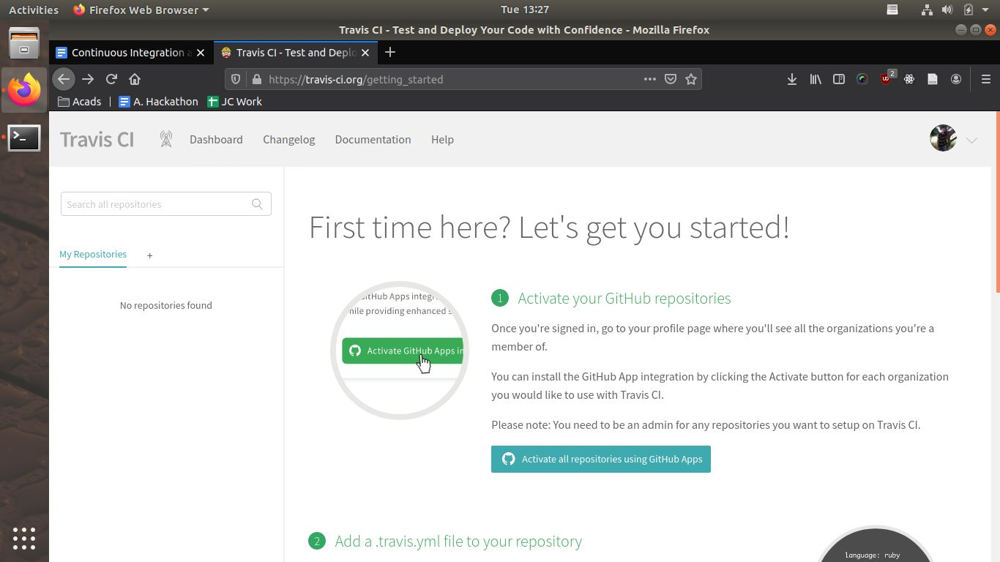
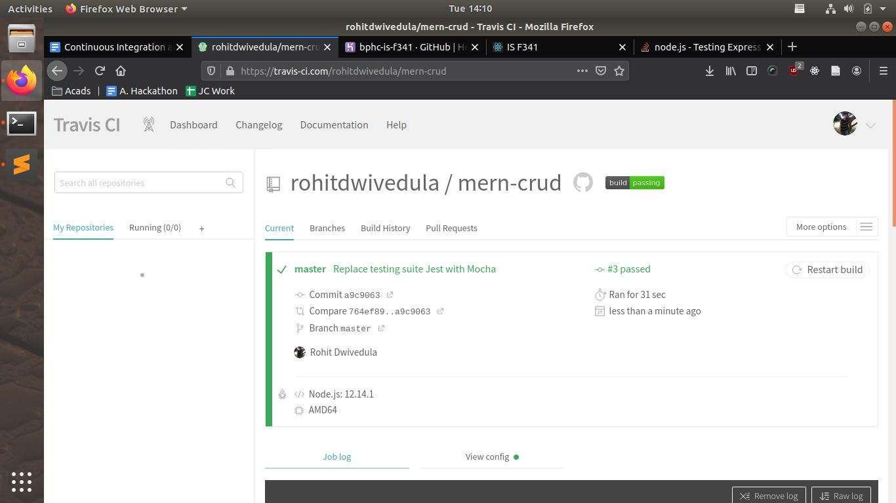

# Deploy Instructions

1. If you haven't already, create a fork of this repo, and create Google OAuth and MongoDB Atlas credentials (explained in the [installation guide](installation.md))
2. Create an account on Heroku, sign in and create a new app. The new app’s dashboard will look something like shown below. Click on the deploy tab and click on the deploy using Github option. You will be asked to log in to your Github account and give access, after which you’ll be able to find the repo that you forked in the previous step. Click on the connect button.

3. Scroll down on the same page a bit more to find the “manual deploy” option and deploy the master branch.

4. While the app is being deployed go to the Settings tab, and add three config variables `MONGODB_URI`, `GOOGLE_CLIENT_ID` and `GOOGLE_CLIENT_SECRET`, which you created in step 1.

5. Click on the open app button after a while and it should be deployed.

# Continuous Integration/Deployment

Travis CI has been set up on ​this git repository​ - take a look at the `.travis.yml` file:
```
language: node_js
node_js:
  - 12.14.1
script:
  - "npm run test"
```
If you've installed the app on your computer try running `npm run test` to see a couple of tests that have been set up - some of the tests are just hello world/placeholder tests just to demonstrate CI/CD but there are 2-3 real API tests too. You should get an output that looks like this on running the test:

```
  Basic Math
    #indexOf()
      ✓ should return -1 when the value is not present
    Addition
      ✓ should return 3 when 1, 2 is added

  Test API
    Endpoint /api
      ✓ returns correct status
      ✓ welcome message
    Test intrusion: access protected endpoints with no login
      ✓ /api/movies returns unauthorized
```
To setup TravisCI:

1. Go to​ [travis-ci.org​](travis-ci.org​) and create an account with Github.
2. Activate your Github repositories on Travis CI by giving the relevant permissions.

3. Wait for a while as Travis CI connects to Github. Search for the relevant app and click on it. TravisCI will run the unit tests and if you’ve configured everything properly, you’ll see a green screen of success.

4. Go back to the Heroku, and open your app settings and go to the deploy section. Click on the “Enable Automatic Deploys” button. Make sure to select the tick box “Wait for CI to pass before deploy”. Doing this will ensure that your app will be redeployed only if the unit tests pass.
