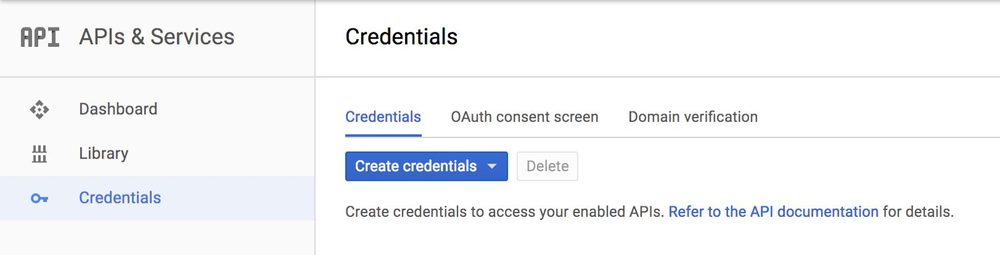
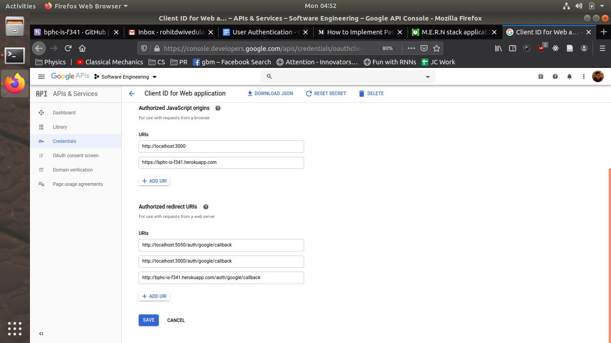
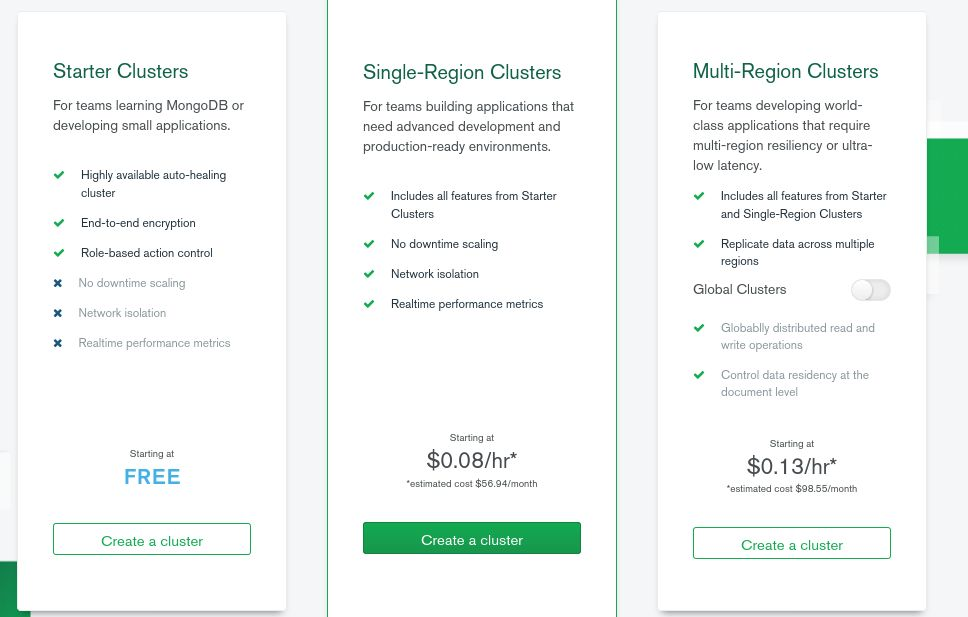
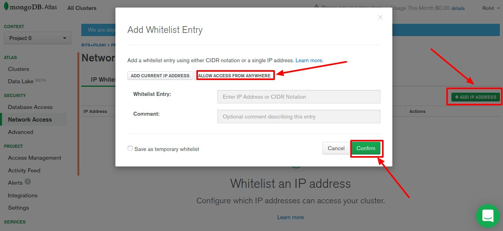
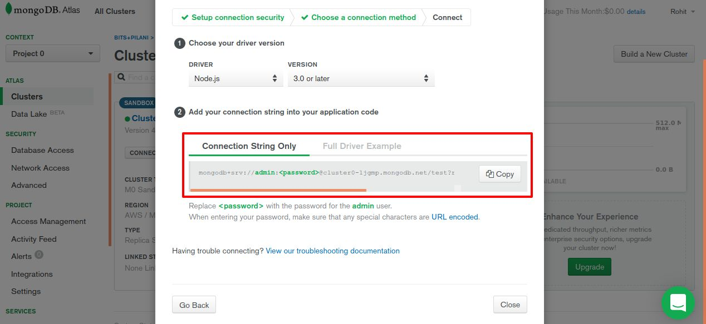

# Installation and Deploy Instructions

By the end of this tutorial, you will have:
- created Google OAuth Client ID and secret key, which is needed for the app to work.
- created a database using MongoDB Atlas (if you don't want to install Mongo)
- run the application on your device.

## Step 1: Creating Google OAuth Credentials
1. Go to ​[Google Developer​ console](https://console.developers.google.com/) and create your application.
2. Click on the create credentials and select OAuth credentials. Fill out the details required.

3. Select the type of application as web app. Then, fill out the fields as follows and click save. Ignore the “bphc-is-f341.herokuapp.com” for now:

4. Save the client ID and secret key that you get.

## Step 2: Creating a Database on MongoDB Atlas
*(You could just install MongoDB on your computer itself, but doing this will save time later while deploying)*
1. Create an account on [​MongoDB Atlas​](https://cloud.mongodb.com/user) and sign in.
2. Create a cluster using the “Starter Clusters” or free category. (left-most):

3. In the next page, you’ll be prompted to choose the configuration of the server - don’t change any of the default options except for the cloud service region - make that “Mumbai/India” (or whatever region is closest to you). It might take a minute or two for the cluster to be created.
4. On the right-hand side toolbar, click on the “Network Access” option (under ‘Security’). Click on the “Add IP Address” button and whitelist all IPs for now. [this is NOT a good security practice, but it will simplify your life, so just use this for now. The alternative is to keep whitelisting each IP address you'll be developing/deploying from]

5. Go to the “Database Access” menu and create a new user. Remember the login and password you used. Once this is done go back to the Clusters screen and click on connect
6. Since we’re using a web app, we want to “Connect with the application” and copy the connector code. Replace the '<password>' in the connector with the password you set in the earlier step. This is the​ **URI​** that you will use to connect to your database.


## Step 3: Run the App (Linux)
To run the application, fork the repository and run these commands:

```
git ​ clone​ github.com/<<YOUR_GITHUB_USERNAME>>/mern-crud
cd​ mern-crud
cp .env-copy .env
```
The `.env` file contains the environment variables needed for the application. Edit the `.env` file to use the `MONGODB_URI` (step 2.6), `GOOGLE_CLIENT_ID` and `GOOGLE_CLIENT_SECRET` (step 1.4) that you created. Now, run these commands to install and get the app working:

```
npm install
cd​ movies-crud
yarn install
yarn build
cd ..
nodemon server.js
```
You should get a message `Listening on port 5050`. Go to `localhost:5050` to view the application.

Note: `yarn build` builds the react app into static files, which are then served by the Node application. While developing/making edits to the client application (front end) it's usually a good idea to use `yarn run` in the `client` folder instead, as this'll save time from rebuilding the application after every change. If you do this, while running on `localhost:3000` if you click the Google sign-in button, it'll probably redirect you to the `localhost:5050` site after logging in - make sure to change the URL back to `3000` before subsequent edits. 

Take a look at the [deploy](deploy.md) instructions to deploy the app to Heroku.